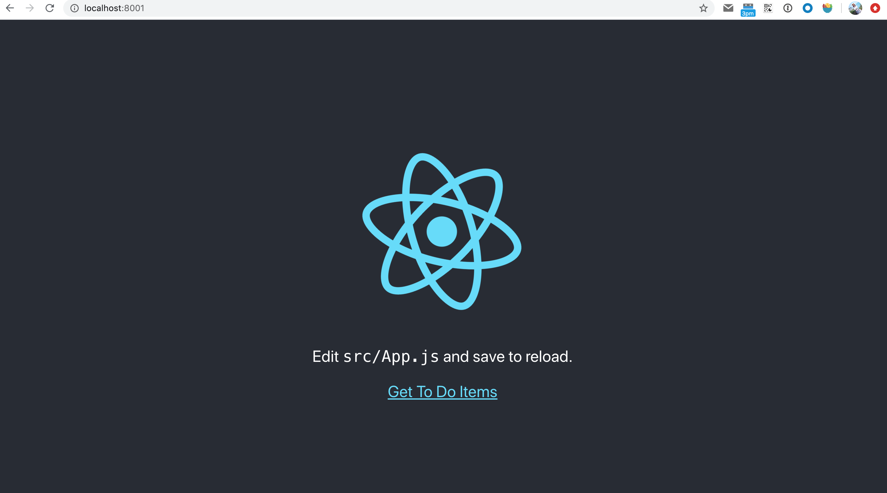
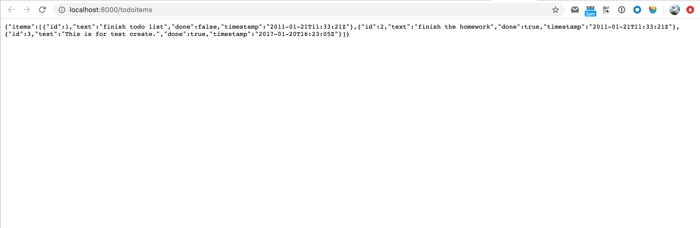

# docker-dojo

Docker-Dojo is a practice project, which is a simple repository to learn and practice docker and docker-compose.


# Architecture


1. Nginx, pull from Docker Hub, connect outer-network and inner-network as a proxy.
2. Web, build from local, frontend in inner-network.
3. API, build from local, backend, have access both in inner-network and data-network.
4. Mysql, pull from Docker Hub, database only in data-network for security.


## Workflow
1. create and run the service in docker container
   * build image:  => web, api
    ```shell script
    docker-compose build
    ```
   * pull image: => Nginx, Mysql
   ```shell script
    docker-compose pull
   ```
   * create and start all containers according to `docker-compose` file
    ```shell script
   docker-compose up
    ```
2. get in the database container and insert some data
   * get in db container
    ```shell script
     docker exec -it <container_id> bash
    ```
   * get in database
   ```shell script
    mysql --host=mysql --user=root --password=root  --database=todo_list
    ```
   * execute sql to insert data, ref: [SQL](TodoListAPI/src/main/resources/TodoList_2017-01-23.sql)
2. `http://localhost:8001/` get in the home page

3. click `Get To Do Items` jump to todo list page


## Process
1. Build single image use docker command;
2. Build whole repo use docker-compose command;

###### Docker Command that might used for the step1
4. Build image
   ```
   docker build --tag <tag_name> .  
   ```
5. Run your image as container
   ```
   docker run --publish 8000:8080 --detach --name <container_name> <tag_name>
   ```
7. Get some container ip address
	```
    docker inspect <container_name>
	```
8. Delete container
   ```
   docker rm --force bb
   ```

